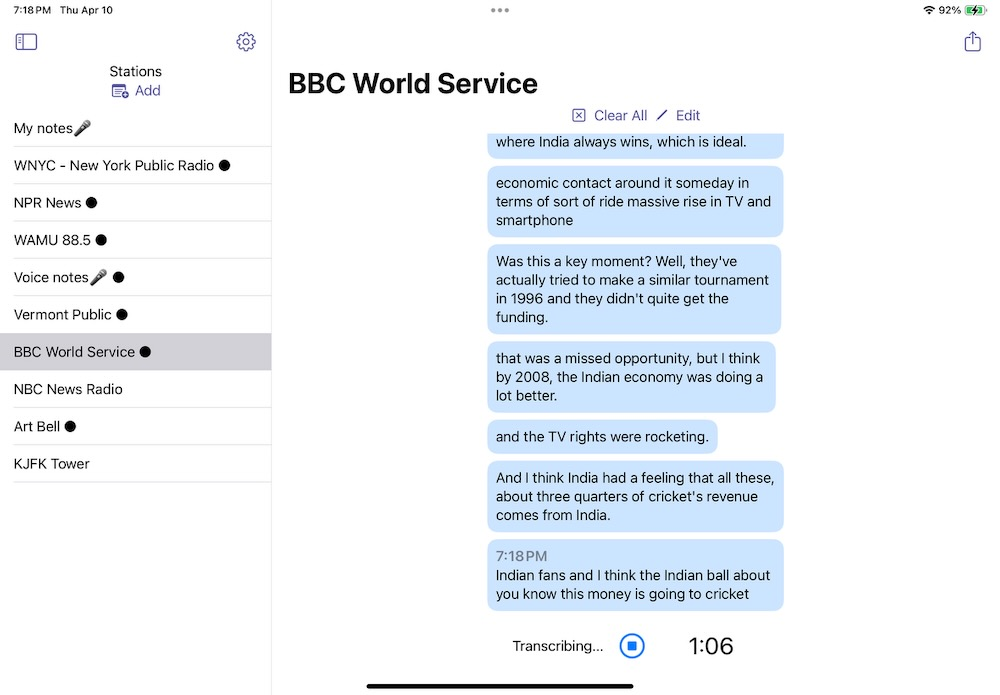

# stream2text
Simple iPad app to transcribe mp3 audio streams or voice memos

It is based on excellent projects https://github.com/ggml-org/whisper.cpp and https://github.com/dimitris-c/AudioStreaming

To get decent performance you need iPad with Apple chip M1, M2, ...

Due to a significant size of AI model (~1.5GB) it is NOT part of this repository.

You can download it using commands (starting from root of the project): 

cd stream2text/whisper.cpp/models

./download-ggml-model.sh medium.en

cp ggml-medium.en.bin ../../Resources

After that you should be able to build application in XCode and run it on iPad.

## License
MIT

Nikolay Klimchuk (C) 2025 
